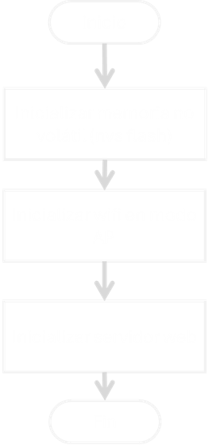

## Informacion general
el presente codigo permite iniciar el ESP32-C6-DevKitC-1 en modo AP (Access Point) con el fin de alojar un servidor que emita un formulario web sobre el cual se ingrese un dato y este llegue a la ESP32.

al conectar la placa y subir el codigo, esta emitira una señal wifi con los siguientes parametros:

1. SSID: RED ESP32 VICTOR
2. PASSWORD: 12345678

cualquier dispositivo, ya sea un smartphone, tablet, PC o portatil puede conectarse a esta red.

una vez conectado puede acceder al sitio web del servidor escribiendo en el navegador la siguiente URL: [http://](http://192.168.4.1/). El sitio web es un formulario sobre el cual se puede ingresar un dato y enviar a la ESP32. una vez esta recibe el dato, lo imprime en el monitor serial.

## Informacion tecnica 

el codigo principal tiene las siguiente estructura:

